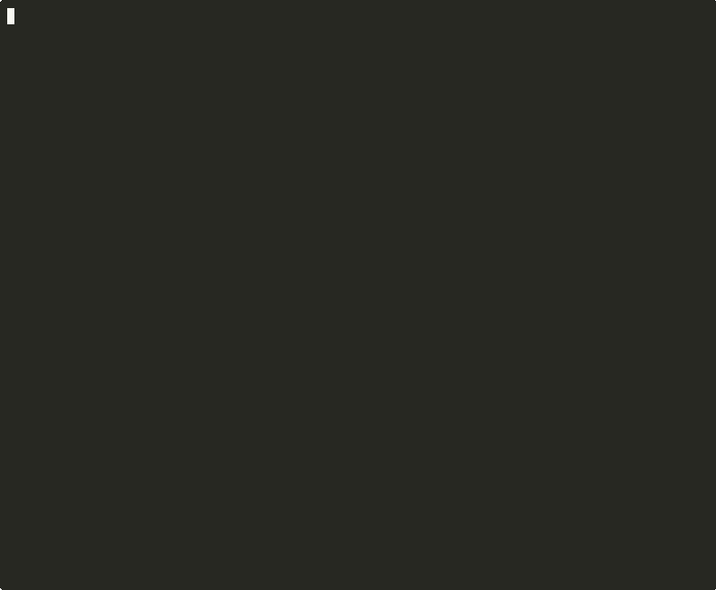
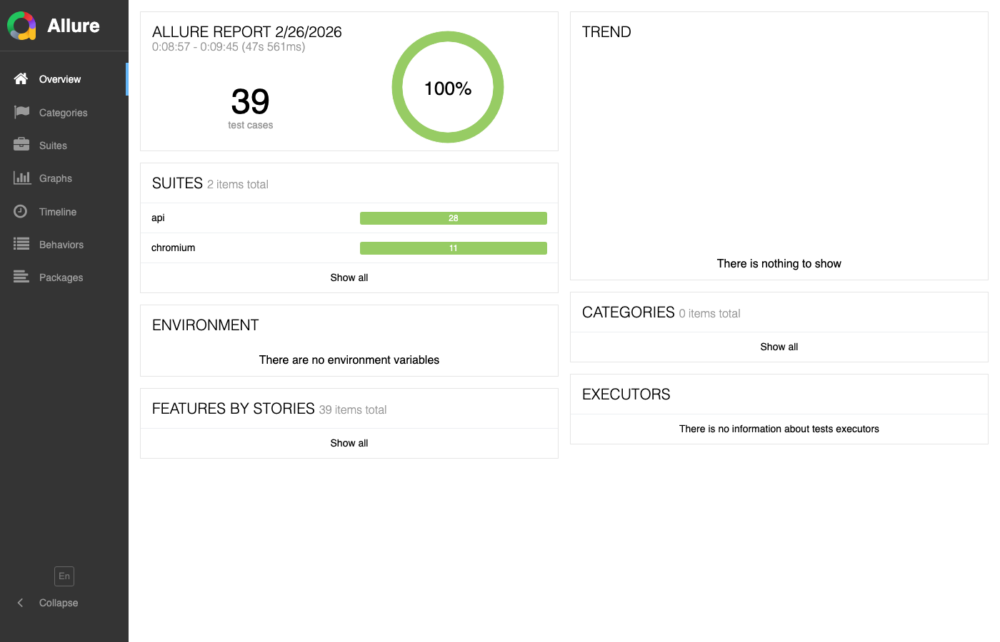

# QA Portfolio — Restful-Booker-Platform

[](https://github.com/adrianagit87/qa-portfolio-restful-booker/actions/workflows/playwright.yml)

Proyecto de portafolio QA que demuestra un ciclo completo de pruebas sobre la plataforma [Restful-Booker](https://automationintesting.online): desde la estrategia y documentación manual hasta la automatización con Playwright y la integración continua con GitHub Actions.

---

## 🎯 Objetivo

Demostrar amplitud QA aplicada a un proyecto real:
- Criterio y estrategia de pruebas (no solo ejecución)
- Cobertura de API y UI en un mismo proyecto
- Automatización que nace del análisis, no al revés
- Pipeline CI/CD funcional desde el primer commit

---

## 🎬 Demo



---

## 📈 Reporte Allure

[](https://adrianagit87.github.io/qa-portfolio-restful-booker/allure-report)

> 🔗 [Ver reporte interactivo en vivo](https://adrianagit87.github.io/qa-portfolio-restful-booker/allure-report)

---

## 📊 Métricas del proyecto

| Métrica | Valor |
|---------|-------|
| Total de tests automatizados | 39 |
| Tests de API | 28 |
| Tests de UI (Chromium) | 11 |
| Tasa de éxito | 39/39 — 100% ✅ |
| Tiempo de ejecución en CI | ~12 minutos |
| Bugs documentados | 7 |
| Casos de prueba manuales | 53 |

---

## 🛠️ Stack técnico

| Área | Herramienta |
|------|-------------|
| Automatización | Playwright 1.58.2 + TypeScript |
| Patrón de diseño | Page Object Model (POM) |
| CI/CD | GitHub Actions |
| Reporte de resultados | Playwright HTML Report |
| API Testing | Playwright APIRequestContext |
| Pruebas manuales de API | Postman |

---

## 🗂️ Estructura del proyecto

```
qa-portfolio-restful-booker/
├── .github/
│   └── workflows/
│       └── playwright.yml            # Pipeline CI/CD
├── docs/
│   ├── test-plan.md                  # Estrategia y alcance
│   ├── web-test-cases.md             # Casos de prueba UI manuales
│   ├── api-test-cases.md             # Casos de prueba API manuales
│   └── bug-reports.md                # 7 bugs documentados con severidad
├── tests/
│   ├── ui/
│   │   ├── booking.spec.ts           # 3 tests — flujo E2E + caso negativo
│   │   ├── contact.spec.ts           # 4 tests — formulario de contacto
│   │   └── cross-validation.spec.ts  # 4 tests — consistencia UI vs API
│   └── api/
│       ├── auth.spec.ts              # 3 tests — autenticación
│       ├── rooms.spec.ts             # 12 tests — CRUD habitaciones
│       └── bookings.spec.ts          # 13 tests — CRUD reservas
├── pages/
│   ├── HomePage.ts                   # Page Object — reserva
│   └── ContactPage.ts                # Page Object — contacto
├── fixtures/
│   └── test-data.ts                  # Datos de prueba centralizados
├── helpers/
│   └── api.helpers.ts                # Helpers reutilizables de API
├── CASOS_DE_PRUEBA.md                # Reporte completo de 34 casos
├── playwright.config.ts
├── package.json
└── README.md
```

---

## 🚀 Cómo ejecutar los tests

### Requisitos
- Node.js 20+
- npm

### Instalación

```bash
git clone https://github.com/adrianagit87/qa-portfolio-restful-booker.git
cd qa-portfolio-restful-booker
npm ci
npx playwright install chromium
```

### Ejecución

```bash
# Todos los tests
npm test

# Solo API (rápido, sin browser)
npm run test:api

# Solo UI (Chromium)
npm run test:ui

# Ver reporte HTML interactivo (Playwright nativo)
npm run test:report

# Ver reporte Allure (requiere Allure CLI instalado)
npm run allure:generate
npm run allure:open
```

> **Reporte Allure público:** cada push a `main` genera y publica el reporte en
> **[adrianagit87.github.io/qa-portfolio-restful-booker/allure-report](https://adrianagit87.github.io/qa-portfolio-restful-booker/allure-report)**

---

## 📋 Documentación

| Documento | Descripción |
|-----------|-------------|
| [Test Plan](docs/test-plan.md) | Estrategia, alcance, riesgos y criterios de calidad |
| [Casos de prueba — Web](docs/web-test-cases.md) | Casos UI manuales: navegación, contacto, reserva, admin |
| [Casos de prueba — API](docs/api-test-cases.md) | Casos API manuales: auth, rooms, bookings |
| [Reporte de bugs](docs/bug-reports.md) | 7 bugs de contrato API documentados con severidad |
| [Tests automatizados](CASOS_DE_PRUEBA.md) | 39 casos automatizados con resultado y cleanup |
| [Allure Report](https://adrianagit87.github.io/qa-portfolio-restful-booker/allure-report) | Reporte interactivo publicado en GitHub Pages |

---

## 💡 Decisiones de diseño destacadas

**Pirámide de pruebas aplicada** — mayor cobertura en API (más rápidas y estables) y UI focalizada en flujos E2E críticos.

**Validación cruzada UI vs API** — casos que verifican consistencia entre lo que muestra la interfaz y lo que retorna la API. Esto demuestra criterio QA más allá de la ejecución de scripts.

**Cleanup automatizado** — todos los tests que crean datos usan `afterEach` para eliminarlos, garantizando aislamiento entre ejecuciones en un entorno compartido.

**Fechas dinámicas** — los tests de reserva generan fechas 3000+ días en el futuro para evitar colisiones con otros usuarios del entorno demo.

**Fixtures centralizados** — ningún test hardcodea datos de negocio. Todo está en `fixtures/test-data.ts` para fácil mantenimiento.

**Hallazgos reales de la API** — durante la implementación se identificaron 7 discrepancias entre la documentación oficial y el comportamiento real del servidor, todas documentadas como bugs de contrato.

---

## 👩‍💻 Sobre este proyecto

Desarrollado por **Adriana Troche** — Senior QA Engineer con más de 15 años de experiencia en pruebas de software y más de 3 años en automatización.

[](https://www.linkedin.com/in/adriana-troche-robles)

---

*Stack: Playwright · TypeScript · GitHub Actions · Page Object Model*

---

## Proyecto relacionado

[demoqa-screenplay](https://github.com/adrianagit87/demoqa-screenplay) — proyecto de portafolio
complementario que implementa el patrón **Screenplay** desde cero (sin Serenity/JS) sobre DemoQA.
